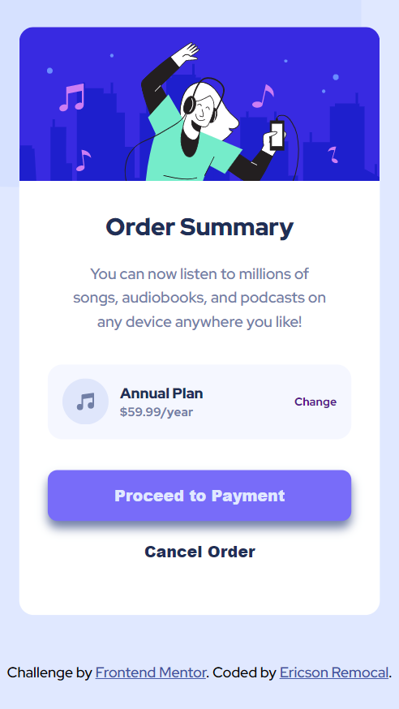

# Frontend Mentor - Order summary card solution

This is a solution to the [Order summary card challenge on Frontend Mentor](https://www.frontendmentor.io/challenges/order-summary-component-QlPmajDUj). Frontend Mentor challenges help you improve your coding skills by building realistic projects.

## Table of contents

- [Overview](#overview)
  - [The challenge](#the-challenge)
  - [Screenshot](#screenshot)
  - [Links](#links)
- [My process](#my-process)
  - [Built with](#built-with)
  - [What I learned](#what-i-learned)
  - [Continued development](#continued-development)
  - [Useful resources](#useful-resources)
- [Author](#author)

**Note: Delete this note and update the table of contents based on what sections you keep.**

## Overview

### The challenge

Users should be able to:

- See hover states for interactive elements

### Screenshot

Mobile Design

Hover State

Desktop Design

### Links

- Solution URL: [repo link](https://your-solution-url.com)
- Live Site URL: [order-summary-component](https://your-live-site-url.com)

## My process

### Built with

- Semantic HTML5 markup
- Using rems instead of pixels
- Flexbox
- Mobile-first workflow
- [Sass](https://sass-lang.com/) - CSS Pre-Processor

### What I learned

This challenge serve as a refresher using a css pre-processor called sass

### Continued development

I want to continue focusing on designing on the web, like using a css preprocessor like sass and use it's features like mixins and many more.

### Useful resources

- [Responsive Breakpoints](https://www.freecodecamp.org/news/css-media-queries-breakpoints-media-types-standard-resolutions-and-more/) - This helped me for refresh for the standard breakpoints in responsive design. I really liked this pattern and will use it going forward.
- [Flexbox](https://css-tricks.com/snippets/css/a-guide-to-flexbox/) - This is an amazing article which helped me to remember things that I forgot about flexbox. I'd recommend it to anyone still learning this concept.

## Author

<!-- - Website - [Add your name here](https://www.your-site.com) -->

- Frontend Mentor - [@EricsonRemocal05](https://www.frontendmentor.io/profile/EricsonRemocal05)
- Twitter - [@EricsonRemocal](https://twitter.com/EricsonRemocal)
